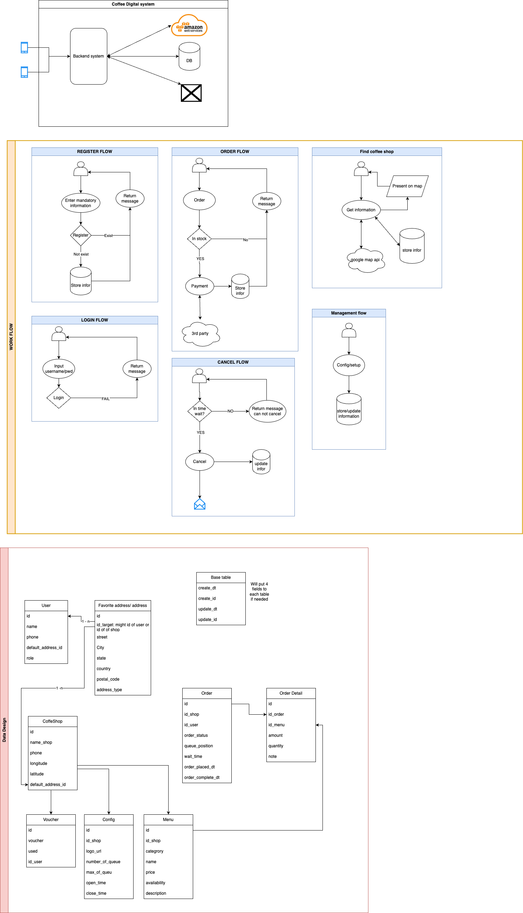

# Read Me First

To run graddle project: stay root folder and use command: 
```shell
./gradlew bootRun
```

To terminate process use: press `Ctrl + C`

The link below to access swagger:

``` 
http://localhost:8080/CoffeeDigital/swagger-ui/index.html

http://localhost:8080/CoffeeDigital/actuator/health
```

#### RUN TESTING
Run Unit test
```shell
./gradlew test
```

# SETUP RUN ON MACOS

### Check requirement

Show place install JDK

```shell
java_home -V

/usr/libexec/java_home -V
```

```shell
export PATH=$PATH:/Users/lqnham/Library/Java/JavaVirtualMachines/corretto-17.0.6/Contents/Home/bin
```

### RUN AND DEPLOY WITH DOCKER

- build image ```sudo docker build -t coffeedigital .```

- To check information
  ```docker ps```

- Mapping port
  ```docker run -p [port_your_pc]:[port_docker] [image_name]```

- port_docker: check on Dockerfile
- port_your_pc: any available port


- run image
  ```docker run -p 8080:8080 coffeedigital```

